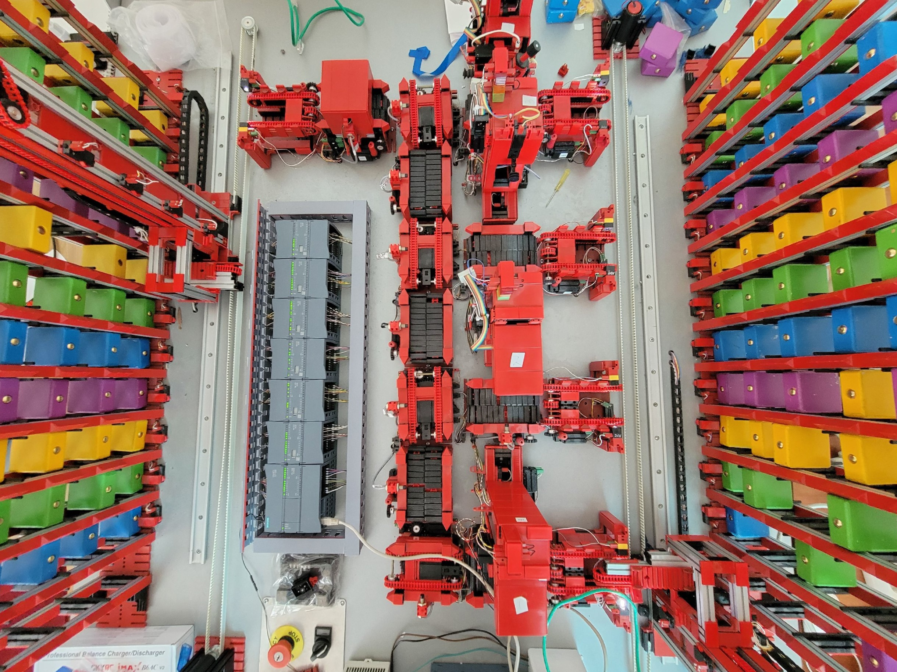

# Lightsout Factory - Experiment #2 "Shares"

<h3><b>Цель эксперимента "Shares":</b></h3>
Обеспечить одновременную обработку и доставку нескольких блоков по различным производственным линиям с использованием алгоритма распределения долей

 

<h3><b>Демонстрация работы эксперимента:</b></h3>
TODO

 

<h3><b>Описание эксперимента:</b></h3>
<ul>
  <li>Определение долей</li>
  <li>Выбор производственных линий в соответствии с долями</li>
  <li>Доставка блоков на различные линии</li>
  <li>Обработка блоков</li>
  <li>Доставка блоков на склад хранения</li>
</ul>

